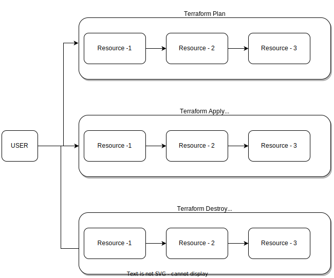

# Object-Oriented Jenkins Pipeline for Terraform

## 🎯 What is This Project?

This project demonstrates a **smart, reusable way to automate infrastructure deployment** using Jenkins and Terraform. Instead of creating separate pipelines for each action (plan, apply, destroy), we build **one flexible pipeline that adapts based on your choices**.

Think of it like a **vending machine**: instead of having three separate machines for snacks, drinks, and candy, you have one machine where you select what you want, and it delivers it to you.

---

## 📚 Key Concepts Explained

### What is Terraform?
**Terraform** is a tool that lets you define your cloud infrastructure (servers, networks, databases, etc.) as **code**. Instead of clicking buttons in the cloud console, you write configuration files, and Terraform creates everything for you automatically.

### What is Jenkins?
**Jenkins** is an automation server that runs your Terraform commands automatically. You tell it "when something changes, run Terraform to update my infrastructure."

### The Problem with Traditional Pipelines

Traditionally, if you wanted three different actions:
- **Terraform Plan** (preview what will change)
- **Terraform Apply** (actually create the resources)
- **Terraform Destroy** (delete everything)

You'd need **three separate pipelines**! ❌

### Our Solution: One Smart Pipeline

With this **object-oriented approach**, you have:
- **One pipeline** that works like a template
- **Multiple parameters** you select before running
- The pipeline **adapts and runs exactly what you need** ✅

---

## 🏗️ The Infrastructure Architecture

This project manages three separate modules that work together:

### 1. **Networking Module** 🌐
Creates the foundational network layer:
- 1 VPC (Virtual Private Cloud) - your isolated network in AWS
- 1 Subnet - a segment within the VPC where resources live

### 2. **Compute Module** 💻
Creates computing resources that do the actual work:
- 1 IAM Role - defines permissions for services
- 1 Lambda Function - serverless code that runs on-demand
- 1 EC2 Instance (t2.micro) - a small virtual server

### 3. **Notifications Module** 🔔
Creates communication infrastructure:
- 1 SNS Topic - a message hub
- 1 Email Subscription - sends notifications to your email

### 📁 Directory Structure
```
.
├── Jenkinsfile                    # The pipeline definition
├── main.tf                        # Main Terraform configuration
└── modules/
    ├── networking/                # Network resources
    │   ├── networking.tf
    │   └── output.tf
    ├── compute/                   # Computing resources
    │   ├── compute.tf
    │   └── variables.tf
    └── notifications/             # Notification resources
        └── sns.tf
```

---

## 🚀 How the Jenkins Pipeline Works

### Step 1: **Build** 🔨
- Clones the code from GitHub
- Prepares the environment

### Step 2: **Init** ⚙️
- Runs `terraform init`
- Downloads required Terraform modules and plugins

### Step 3: **Validate** ✅
- Checks if Terraform configuration files are valid
- Catches syntax errors early

### Step 4: **Action** (The Smart Part!) 🎛️
This is where the pipeline becomes flexible:

**You Choose Your Actions:**
- 📋 **plan** - Shows what will change (no changes made)
- ✨ **apply** - Creates or updates resources
- 🗑️ **destroy** - Deletes all resources

**You Choose Which Modules to Affect:**
- ☐ Networking
- ☐ Compute  
- ☐ Notification

The pipeline **only runs on the modules you select** with the action you choose!

### Step 5: **Terraform Completed** ✔️
- Shows completion message
- All done!

### 📊 Visual Pipeline Flow


The diagram above shows how the pipeline branches into different modules. Each module executes independently based on your selections.

---

## 💡 The Traditional vs. Smart Approach

### Traditional Approach (Multiple Pipelines)


**Problems:**
- Three separate pipelines to maintain
- Lots of duplicate code
- Confusing to manage multiple versions

### Smart Approach (This Project)
**Benefits:**
- One pipeline, many configurations
- Change parameters, get different behavior
- Easier to maintain and update
- Scales easily to more modules

---

## 🔄 Real-World Example

**Run #24**: Apply networking and compute resources
```
Parameters Selected:
- Action: apply
- Networking: ✓ (enabled)
- Compute: ✓ (enabled)
- Notification: ✗ (disabled)

Result: Only networking and compute are created
```

**Run #25**: Apply everything
```
Parameters Selected:
- Action: apply
- Networking: ✓
- Compute: ✓
- Notification: ✓

Result: All three modules are created
```

**Run #26**: Destroy everything
```
Parameters Selected:
- Action: destroy
- Networking: ✓
- Compute: ✓
- Notification: ✓

Result: All resources are deleted
```

---

## ⚙️ Pipeline Parameters Explained

### 1. **Actions** (Required Choice)
```
- plan   : Preview changes without making them
- apply  : Create or update resources
- destroy: Delete all resources
```

### 2. **Networking** (Optional Checkbox)
```
Default: False (disabled)
When True: Applies the action to the Networking module
```

### 3. **Compute** (Optional Checkbox)
```
Default: False (disabled)
When True: Applies the action to the Compute module
```

### 4. **Notification** (Optional Checkbox)
```
Default: False (disabled)
When True: Applies the action to the Notifications module
```

---

## 🔐 AWS Credentials

The pipeline uses Jenkins credentials to securely store AWS access keys:
```groovy
AWS_ACCESS_KEY_ID       # Your AWS access key ID
AWS_SECRET_ACCESS_KEY   # Your AWS secret access key
AWS_DEFAULT_REGION      # The AWS region where resources will be created
```

**Important:** These credentials should be stored securely in Jenkins, never in code!

---

## 🎓 Key Design Principles

### 1. **Modularity**
Each infrastructure component is separate and independent. You can create networking without compute, or compute without notifications.

### 2. **Reusability**
One pipeline definition works for all actions. The parameters make it flexible without code duplication.

### 3. **Loose Coupling**
Modules don't depend on each other (except Compute depends on Networking's output). Changes to one module don't break others.

### 4. **Object-Oriented Thinking**
- The **pipeline is a class** (template)
- Each **run with different parameters is an object** (instance)
- Different parameter values create different behaviors

---

## 🚦 Terraform Workflow Explained

### `terraform init`
Initializes your working directory with:
- Required plugins
- Backend configuration
- Module dependencies

### `terraform validate`
Checks if your configuration is syntactically correct:
- Valid HCL syntax
- Required arguments present
- No obvious errors

### `terraform plan`
Shows what **will** happen:
- Resources to create
- Resources to modify
- Resources to destroy

**No actual changes are made!** This is safe to run anytime.

### `terraform apply`
Actually creates the resources shown in the plan:
- Provisions infrastructure
- Updates the state file
- Makes real changes in AWS

### `terraform destroy`
Removes all managed resources:
- Deletes infrastructure
- Updates the state file
- **Warning:** This is destructive!

---

## 🎯 When to Use Each Action

### 📋 Use `plan`:
- Before running `apply` to see what will change
- To verify your configuration is correct
- In pull request reviews
- To plan infrastructure changes

### ✨ Use `apply`:
- After reviewing a plan
- To provision new infrastructure
- To apply configuration updates
- When you're confident in the changes

### 🗑️ Use `destroy`:
- When tearing down development/test environments
- To clean up unused infrastructure
- To save costs
- When you no longer need the resources

---

## 💻 Running This Pipeline

### Prerequisites
1. Jenkins installed and running
2. Terraform installed on Jenkins agent
3. AWS credentials configured in Jenkins
4. GitHub repository access

### Steps
1. Create a new Pipeline job in Jenkins
2. Point it to this Jenkinsfile
3. Run the job
4. Select your desired:
   - Action (plan/apply/destroy)
   - Modules (Networking/Compute/Notification)
5. Let Jenkins execute!

---

## 🔗 Dependencies Between Modules

- **Networking** → Standalone (no dependencies)
- **Compute** → Depends on Networking (needs the subnet ID)
- **Notification** → Standalone (no dependencies)

This means:
- You can create/destroy Networking independently
- You can create/destroy Notification independently
- You need Networking before creating Compute
- Destroying Compute doesn't affect Networking

---

## 📈 Continuous Delivery vs. Continuous Deployment

This pipeline follows **Continuous Delivery** principles:
- ✅ Automates testing and validation
- ✅ Uses parameters for human approval gates
- ✅ You choose when to apply changes
- ✅ Safe, controlled deployments

Not full Continuous Deployment because:
- ❌ Doesn't automatically deploy to production
- ❌ Requires manual parameter selection
- ❌ Gives you control over when changes happen

---

## 🎓 Learning Path

1. **Start here:** Understand what Terraform does
2. **Next:** Learn about the three modules
3. **Then:** Run `terraform plan` to see what will be created
4. **Practice:** Run individual modules using the parameters
5. **Master:** Create new modules and add them to the pipeline

---

## 🤝 Next Steps

1. Fork or clone this repository
2. Set up Jenkins credentials for AWS
3. Create a Jenkins Pipeline job pointing to this Jenkinsfile
4. Run with different parameter combinations
5. Observe what changes in each scenario
6. Extend with more modules as needed!

---

## 📝 Summary

This project teaches a powerful pattern:
- **One flexible pipeline** beats multiple rigid ones
- **Modularity** makes infrastructure manageable
- **Parameters** provide control without code changes
- **Object-oriented thinking** applies to CI/CD pipelines too!

Happy automating! 🚀
